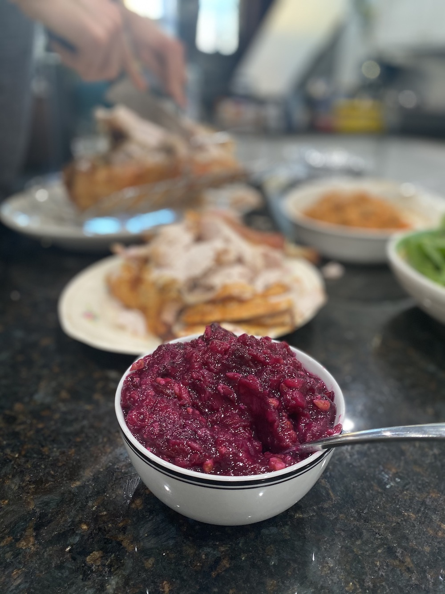

# Scarborough Holiday Cranberry Sauce

My sweet grandmother is mostly known for her loving dedication and ability to smoke you at [bridge](https://en.wikipedia.org/wiki/Contract_bridge). But above all else, she is renowned for her cranberry sauce. This recipe has been passed down through many generations of the Scarborough family, having a special place at the dinner table during Thanksgiving, Christmas or anytime we eat together.

 - **Time:** ~1h30m, most of which is idling while recipe cools
 - **Yields:** ~10 generous servings
 - **Best paired with:** Traditional turkey dinner

## Ingredients
- Raw cranberries – One 12oz bag 
- Crushed pineapples - One medium can (20oz)
- Sugar - Half cup 
- Walnuts - Half cup, coarsely crushed

## Directions
1. Rinse raw cranberries in strainer, remove stems and any cranberries that appear white, rancid, shriveled or generally unsavory (you'll know it when you see it). *Only perfect cranberries make the cut.*
2. Strain pineapple liquid into bowl (should yield around 1 cup, sometimes less - it's fine), be sure to keep the solid pineapples to the side.
3. Add pineapple juice to pot and bring to moderate boil.
4. Once pineapple at a soft boil, add cranberries.
5. Cook for five to ten minutes, stirring continuously. You will begin to see the berries split and hear very distinct POP sounds as they rupture.
6. Continue cooking cranberries until all have popped and create a purplish slurry.
7. Add sugar and stir.
8. Remove from heat, cool in fridge for 45-60 minutes.
9. Once cooled, add walnuts and pineapple chunks, stir.
10. Serve in a cut crystal bowl.

--- 

## Make Log

### Nov 26, 2020
Made a large batch for friends and family, no negative effects from tripling ingredients. Used Ocean Spray "superfruit" cranberries (12oz). Didn't need to pick out many rancid berries, usually need to remove about a dozen per bag. Turned out great!

### Dec 25, 2019
Remembered the sugar this time! Didn't use a full 20oz can of pineapples, but whatever, still came out really well.

### Dec 25, 2018
First time making myself. Called Grandma for the recipe. She forgot to tell me about the sugar, so came out very bitter and bland.
